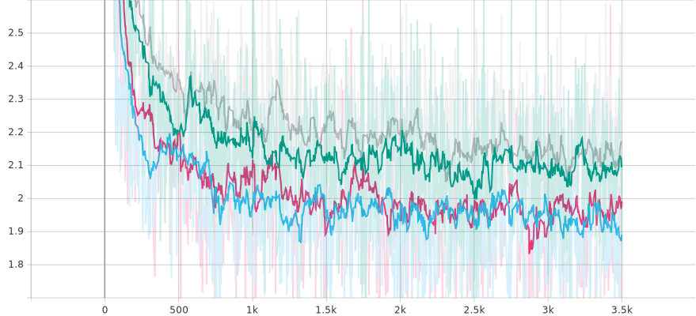
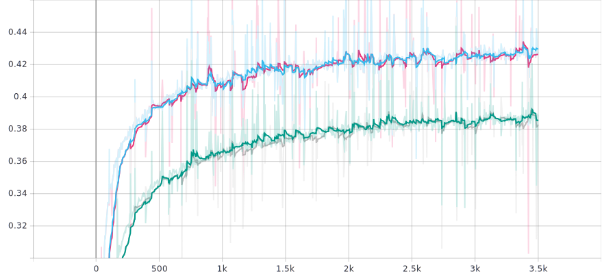
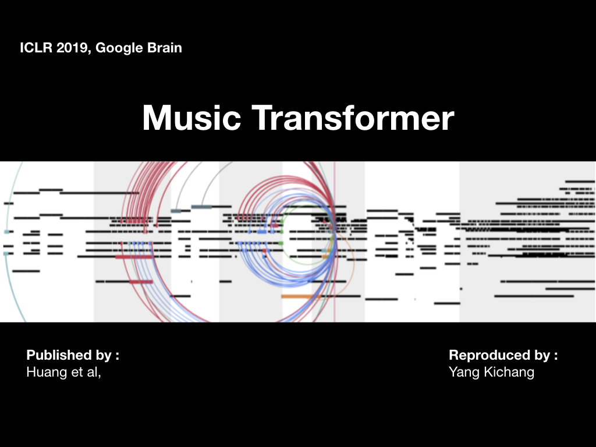

# Music Transformer: Generating Music with Long-Term Structure

- 2019 ICLR, Cheng-Zhi Anna Huang, Google Brain
- Re-producer : Yang-Kichang
- [paper link](https://arxiv.org/abs/1809.04281) 
- [paper review](https://github.com/SSUHan/PaparReviews/issues/13)


## Abstract

1. This Repository is perfectly cometible with **pytorch**


## Contribution

* Domain: Dramatically reduces the memory footprint, allowing it to scale to musical sequences on the order of minutes.
* Algorithm: Reduced space complexity of Transformer from O(N^2D) to O(ND).


## Midi Download	

```bash
$ sh script/{ecomp_piano_downloader, midi_world_downloader, ...}.sh
```

* Some of these imported from [performaceRNN re-built repository](https://github.com/djosix/Performance-RNN-PyTorch) by [djosix](https://github.com/djosix)


## Prepare Dataset	

```bash
$ python preprocess.py {midi_load_dir} {dataset_save_dir}
```


## Training

```bash
$ python train.py -c {config yml file 1} {config yml file 2} ... -m {model_dir}
```


## Hyper Parameters

* learning rate : 0.0001
* head size : 4
* number of layers : 6
* seqence length : 2048
* embedding dim : 256 (dh = 256 / 4 = 64)
* batch size : 2


## Result

-  Baseline Transformer ( Green, Gray Color ) vs Music Transformer ( Blue, Red Color )

* Loss

  

* Accuracy

  


## Generate Music

```bash
$ python generate.py -c {config yml file 1} {config yml file 2} -m {model_dir}
```


## Generated Samples ( Youtube Link )

* click the image.

  [](https://www.youtube.com/watch?v=n6pi7QJ6nvk&list=PLVopZAnUrGWrbIkLGB3bz5nitWThIueS2)
